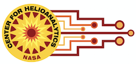

#  Magnetosphere Online Seminar Series Tutorials

Brought to you by: 

    

This series of tutorials is part of the Magnetosphere Online Seminar Series (MOSS). The seminars are held every Monday at 12pm ET.  

These tutorials are made possible through the support of the NASA GSFC Advanced Software Technology Group.  
See their extensive python course materials here:  https://github.com/astg606/py_courses

To start, you can take the <a href="https://forms.gle/PTV6xFCA21NYkqfp9">Python Assessment Test</a>

A score of 80% or higher means you may want to skip the "beginner" course material.

### MOSS Tutorial Series Schedule

| Date | Lecture Topic | Link |  |
|------|---------------|------------------|----------|
| 28 February 2022 | **Why Learn Python?** | [Intro Presentation](https://colab.research.google.com/drive/1ZRyBFO_gsAJGrlPdOFUxUi7pA7a19IpE?usp=sharinghttps://colab.research.google.com/drive/1ZRyBFO_gsAJGrlPdOFUxUi7pA7a19IpE?usp=sharing) |  |
| 28 February 2022 | **Intro to Python Notebooks and Code Sharing**  |  |  |
| 28 March 2022 | **How do I get to my data?**  |  |  |
| 11 April 2022 | **Basic data manipulation and display**  |  |  |
| 16 May 2022 | **Topics TBD (see below)**  |  |  |
| | Glossary of python terms | ||

Future tutorials:  *Data Manipulation with Numpy and Pandas;  Graphs and Visualization; Intro to Machine Learning with Python*

### Feedback and suggestions

Future topics for the tutorials are still being determined.  Please [let us know what you'd like to see in our feedback form.](https://forms.gle/2ehrmZsmuw9fvoYp8)

## Other Heliophysics Python Resource Materials

- [Python in Heliophysics Community](https://heliopython.org) (PyHC):  Promoting and facilitating the use and development of Python for Heliophysics.
PyHC is a community knowledge base for performing heliophysics research in Python, aiming to provide a variety of tutorials, resources, 
a list of useful packages, general discussion, and advice.

- HelioML book [helioml.org](https://helioml.org):  Edited by Monica Bobra and James Mason, a curated collection of interactive Jupyter Python notebooks 
that explicitly show the reader how to use machine learning, statistics, and data mining techniques on various kinds of 
heliophysics data sets to reproduce published results.

- Courses taught at NASA GSFC Heliophysics Division:  https://github.com/helio670/agenda

- Michael Kirk’s tutorials (general + Sunpy): https://github.com/MSKirk/tutorials

- Goddard ASTG Python courses (available to Helio community):  
    - Python placement test (if you score >80% you may want to skip the beginner courses):  https://docs.google.com/forms/d/e/1FAIpQLSdXdI4yQI0voiZ8AZFYw5yyrXbiZAU87vHJm574PwP9l8IXdA/viewform
    - Beginner Python: https://github.com/astg606/py_courses/tree/master/beginner_python
    - Full Collection of Courses: https://github.com/astg606/py_courses/tree/master/virtual_courses

## General Python Resources

### Books and texts 
Two excellent beginner books (both are available online under public license but you can support the developers by purchasing the books): 
- "Problem Solving with Python" by Peter D. Kazarinoff https://problemsolvingwithpython.com/
- "The Python Data Science Handbook" by Jake VanderPlas https://jakevdp.github.io/PythonDataScienceHandbook/ 

### Online articles 
- "Towards Data Science" has many articles for beginners to advanced levels on coding and development:  https://medium.com/towards-data-science/
- "KD Nuggets" was started by a space scientist turned data scientist (Kirk Borne). A great way to keep up on what's happening in data science:  https://www.kdnuggets.com/ 

